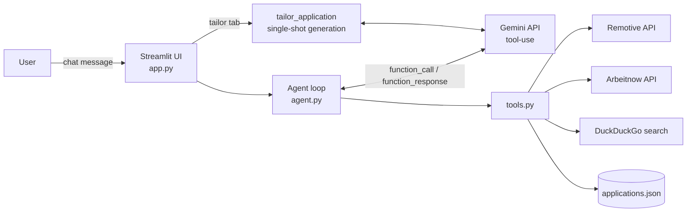

# Job Search Copilot

An AI agent, built on Google Gemini's tool-use (function calling) API, that
takes the grunt work out of job hunting: it searches live job postings,
tailors your resume and drafts a cover letter for a specific role, and keeps
a running tracker of every application — all from one chat interface.

**Live demo:** _add your deployed Streamlit Cloud URL here after deploying (see below)_

## Why this exists

Applying to jobs manually is repetitive: search boards, re-tailor a resume for
every posting, write a cover letter, remember what you already applied to.
This agent automates everything up to the final "Submit" click — it
deliberately does **not** auto-submit applications on external sites (see
[Design decisions](#design-decisions) for why).

## What it does

- **Chat** — ask in plain English ("find me remote backend roles in Python",
  "what's it like working at Stripe", "I applied to the Acme Corp data
  analyst role") and the agent decides which tool to call.
- **Tailor** — paste your resume and a job description, get back a match
  summary, tailored resume bullets, and a cover letter draft.
- **Tracker** — a live dashboard of every application the agent has logged
  for you, filterable by status (saved / applied / interview / offer /
  rejected).

## Architecture



The agent loop in `agent.py` follows the standard tool-use pattern: Gemini
decides which tool to call (if any), `tools.py` executes it and returns a
plain-JSON result, and the result is fed back to Gemini until it produces a
final answer. Tools are pure, independently testable Python functions with
no dependency on the agent loop itself — see `tests/test_tools.py`. Because
tools are provider-agnostic JSON-schema definitions, swapping Gemini for
Claude, OpenAI, or another tool-calling model later only means editing
`agent.py`.

## Project layout

```
.
├── agent.py               # Gemini tool-use loop + resume-tailoring generation
├── tools.py               # Tool implementations + specs (job search, tracker, web search)
├── app.py                 # Streamlit UI (Chat / Tailor / Tracker tabs)
├── tests/test_tools.py    # Unit tests (mocked HTTP, isolated temp files)
├── .github/workflows/ci.yml  # Runs the test suite on every push
├── requirements.txt / requirements-dev.txt
├── .env.example           # Template for local GEMINI_API_KEY
└── .streamlit/secrets.toml.example  # Template for Streamlit Cloud secrets
```

## Run it locally

```bash
git clone https://github.com/<your-username>/job-search-copilot.git
cd job-search-copilot
python -m venv .venv && source .venv/bin/activate   # optional but recommended
pip install -r requirements-dev.txt

cp .env.example .env
# then edit .env and paste your free key from https://aistudio.google.com/apikey

streamlit run app.py
```

Run the tests any time with:

```bash
pytest -v
```

## Deploy it for free (Streamlit Community Cloud)

This is the easiest way to get a live URL to put on your resume/GitHub —
no server to manage.

1. **Push this project to your own GitHub repo** (see the exact commands in
   [Getting this onto your GitHub](#getting-this-onto-your-github) below).
2. Go to **[share.streamlit.io](https://share.streamlit.io)** and sign in
   with your GitHub account.
3. Click **"New app"**, pick your `job-search-copilot` repo, branch `main`,
   and set the main file path to `app.py`.
4. Before (or right after) deploying, open **App settings → Secrets** and
   paste:
   ```toml
   GEMINI_API_KEY = "your-real-key"
   ```
5. Click **Deploy**. In a minute or two you'll get a live URL like
   `https://job-search-copilot-<random>.streamlit.app` — that's the link to
   put on your resume and GitHub profile README.

Any time you push new commits to `main`, Streamlit Cloud redeploys
automatically.

### Alternative: Render / Railway / Fly.io

If you'd rather run it as a container instead of on Streamlit Cloud, the app
still runs anywhere that can run:

```bash
streamlit run app.py --server.port $PORT --server.address 0.0.0.0
```

Set `GEMINI_API_KEY` as an environment variable on whichever platform you
pick.

## Getting this onto your GitHub

From inside this project folder:

```bash
git init
git add .
git commit -m "Initial commit: Job Search Copilot agent"
git branch -M main
git remote add origin https://github.com/<your-username>/job-search-copilot.git
git push -u origin main
```

(Create the empty repo on GitHub first — github.com → New repository — and
don't initialize it with a README, so this push doesn't conflict.)

## Design decisions

- **No auto-submit.** Automatically submitting applications on sites like
  LinkedIn or Indeed on a user's behalf typically violates those sites'
  terms of service, is fragile against logins/CAPTCHAs, and can get a real
  account flagged. This project automates everything *up to* that point —
  finding roles, tailoring materials, tracking status — and leaves the
  actual click to the user.
- **Gemini for the LLM, on purpose.** Gemini's API has a genuinely free tier
  (no credit card) that's generous enough for a demo/portfolio project, so
  anyone cloning this repo can run it for $0. `agent.py` is the only file
  that knows about the model provider — swapping in Claude, OpenAI, or
  another tool-calling model later is a change isolated to that one file.
- **Free, no-key data sources for the demo.** Job search uses the Remotive
  and Arbeitnow public APIs so the whole project runs on free tiers end to
  end. For production use with broader/more accurate listings, swap
  `search_jobs` in `tools.py` for a provider like Adzuna, the Indeed
  Publisher API, or LinkedIn's Jobs API (all require their own API keys).
- **Tools are plain functions.** Every tool in `tools.py` takes JSON-safe
  arguments and returns a JSON-safe dict, independent of any model SDK.
  That keeps them trivially unit-testable (see `tests/test_tools.py`) and
  means the same tools could be wired into a different agent framework
  later without rewriting them.
- **Local JSON for storage.** `applications.json` keeps the project
  zero-dependency for a demo. Swapping in SQLite or Postgres is a small,
  isolated change to `tools.py` alone since the rest of the app only calls
  `track_application` / `list_applications`.
- **Graceful degradation on network failures.** `search_jobs` and
  `web_search` catch request exceptions and return an empty/error result
  instead of crashing, so a flaky network or a rate-limited free API
  degrades the chat reply rather than the whole app. (Both were verified
  with mocked HTTP in `tests/test_tools.py`; live calls need outbound
  network access to `remotive.com`, `arbeitnow.com`, and
  `html.duckduckgo.com`, which is available when run locally or deployed,
  but may be blocked in a locked-down sandbox.)

## Putting this on your resume

A reasonable way to describe it:

> Built and deployed an AI agent (Gemini tool-use / function calling) that
> automates job search workflows — live job search across multiple job
> board APIs, resume/cover-letter tailoring per posting, and application
> tracking — with a Streamlit front end, pytest test suite, and CI via
> GitHub Actions.

## License

MIT — see [LICENSE](LICENSE).
